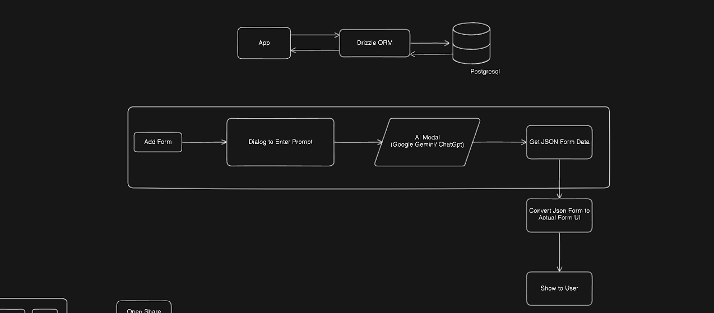

# AI-based Form Building with Payment Gateway

This project is an AI-based form building platform with integrated payment gateways, built using Next.js and Tailwind CSS.


## App Model ON Eraser
- (app.eraser.io/workspace/lgg3ndwiZhLhZAyLKNPX)
## Getting Started

First, run the development server:

```bash
npx create-next-app@latest init
# or
npx shadcn-ui@latest init 
# or
npm install
# or
npm run dev
```

Auth form and Hero section is inspired from hyper ui

## UI Components
-[shadcn UI Components](https://ui.shadcn.com/)

-[DaisyUi](https://daisyui.com/)

-[hero page is from HyperUI](https://www.hyperui.dev/components/marketing/banners)

-[icons is from Lucide reacticons](https://lucide.dev/)


#### Database DashBoard
- https://console.neon.tech/app/projects/proud-star-95824247

## We Are USing Google Gemini Api
- (https://developers.google.com/gemini)
```bash
npm install @google/generative-ai
```

## For The Database We Are USing Postgre SQL On Drizzle
-(https://orm.drizzle.team/docs/get-started-postgresql) >NEON (https://neon.tech/)
-
- Its is an open source database management system that utilizes the SQL querying language. It is a powerful, open source object-relational database system that extends the SQL language combined with many features that safely store and scale the most complicated data workloads.

```bash
step 1
npm i drizzle-orm @neondatabase/serverless
npm i -D drizzle-kit
```


